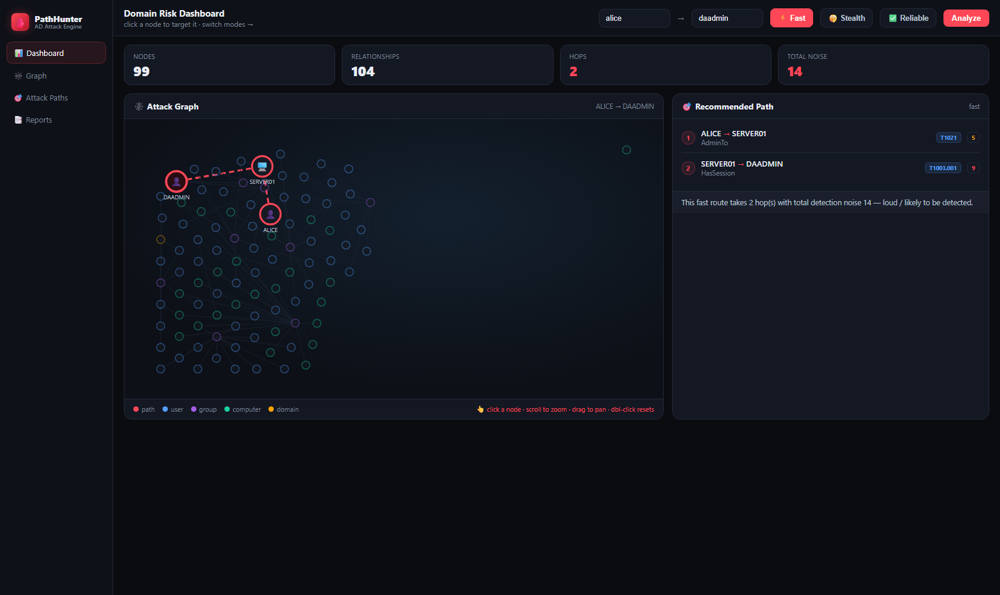
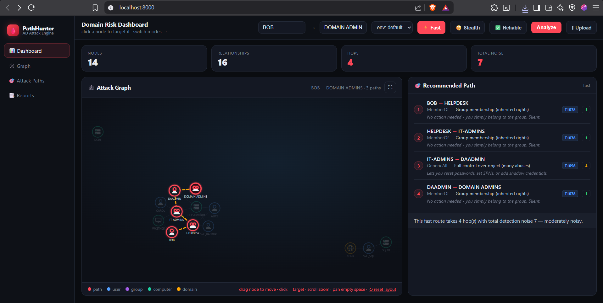
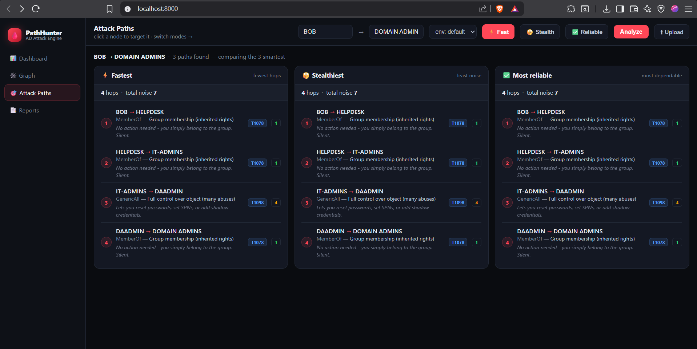
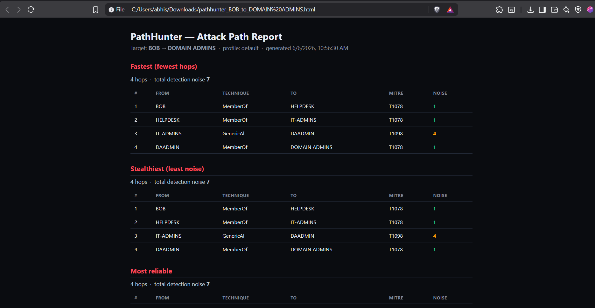

# PathHunter

**An intelligent Active Directory attack-path prioritization engine** — a lightweight, open-source companion to [BloodHound](https://github.com/SpecterOps/BloodHound).

BloodHound shows you the *shortest* path to Domain Admin. **PathHunter reads the same data and tells you which path is *smart* to take** — ranking every route by **fastest**, **stealthiest**, and **most reliable**, with the attack technique, MITRE ATT&CK id, and detection risk for every single hop.



---

## Why it's different

- **Complements BloodHound** — ingests the JSON your team already collects with SharpHound. No new collection step.
- **No database server** — parses BloodHound CE JSON straight into an in-memory graph. Tiny RAM (~50–150 MB), nothing to install, no Neo4j.
- **Decision intelligence, not just a map** — every edge carries a *detection* score (how loud) and a *reliability* score (how dependable), grounded in the real Windows telemetry each technique generates (logon events, password-reset events, LSASS access, AD replication, certificate enrollment…).
- **Situational by design** — environment **profiles** (`edr`, `legacy`, `audited`, …) re-score the same graph so the ranking changes with the estate you're in. LSASS theft is near-suicidal under EDR and routine in a legacy domain — PathHunter reflects that.
- **Built for engagements** — single command, **zero external dependencies** (pure Python standard library), CLI **and** a zero-dependency web dashboard.

## What it does

- Loads BloodHound / SharpHound JSON (CE and legacy shapes: ACLs, group members, lateral-movement collections, sessions, RBCD, SID history, AD CS / ESCx, trusts, and pre-computed edge lists).
- Maps **every relationship to a real attack technique** with a MITRE ATT&CK id, OPSEC notes (red team), remediation guidance (blue team), and authoritative references.
- Ranks attack paths from any principal to any target under three objectives — **fastest** (fewest hops), **stealthiest** (least total noise), **most reliable** — using Dijkstra over the scored graph.
- Ships a browser dashboard: an interactive force-directed attack graph, a side-by-side comparison of the three ranked routes, drag-and-drop upload of your own data, environment-profile switching, and HTML reports.

## Screenshots

**Domain Risk Dashboard** — interactive attack graph with the recommended path for the selected start → target and objective:



**Attack Paths view** — the *fastest*, *stealthiest*, and *most reliable* routes compared side by side, hop by hop:



**Exported HTML report** — a shareable per-engagement report with the technique, MITRE ATT&CK id, and detection noise for every hop:



## Quick start

```bash
# rank attack paths from a user to Domain Admin (bundled sample data)
python -m pathhunter --start alice --target daadmin

# only the quietest route, against your own BloodHound export
python -m pathhunter --data ./bloodhound_export --start bob --target "domain admins" --mode stealth

# re-score for a modern, EDR-heavy estate
python -m pathhunter --start alice --target daadmin --profile edr

# just summarise the loaded graph
python -m pathhunter --summary

# or run the all-in-one demo (summary + scores + ranked paths)
python main.py
```

Run the test suite (no installs needed — pure standard library):

```bash
python -m unittest discover -s tests -t .
```

## Web dashboard

```bash
# one-liner: start the server on the demo data AND open your browser
python -m pathhunter.web --data data/generated --open

# or just run it and open http://localhost:8000 yourself
python -m pathhunter.web
```

On Windows you can also just double-click **`run-dashboard.bat`**.

**Upload your own data:** browse to **http://localhost:8000/upload**, drag in your SharpHound/BloodHound `.json` files, and the dashboard re-charts them instantly. (Try the bundled scenarios in `data/sample/`, `data/generated/`, or `data/upload_tests/`.)

## Validated on real data

PathHunter is tested end-to-end against **real** BloodHound CE output — the public **GOAD v2** forest (108 nodes / 858 edges per domain). Pull it and run:

```bash
python scripts/fetch_real_data.py                  # -> data/goad (real GOAD data, fetched on demand)
python -m pathhunter --data data/goad --start vagrant --target "domain admins"
python -m pathhunter.web --data data/goad --open   # explore it in the dashboard
```

Data source: [m4lwhere/Bloodhound-CE-Sample-Data](https://github.com/m4lwhere/Bloodhound-CE-Sample-Data) — fetched on demand, not redistributed here.

## Project layout

```
pathhunter/
  loader.py      # parse BloodHound JSON -> in-memory graph
  techniques.py  # edge -> attack technique + MITRE + detection/reliability + OPSEC/remediation
  profiles.py    # environment profiles that re-score the graph per situation
  scoring.py     # score each edge (detection risk, reliability, "smartness")
  pathfinder.py  # Dijkstra: best fast / stealthy / reliable path to a target
  cli.py         # argparse command-line interface
  web.py         # zero-dependency dashboard server (python -m pathhunter.web)
main.py          # all-in-one demo on the sample data
web/             # dashboard front-end (index.html)
tests/           # unittest suite (30 tests, standard library only)
data/            # bundled synthetic demo datasets (BloodHound CE format)
scripts/         # dataset generators + real-data / technique fetch helpers
requirements.txt # empty — v1 has no external dependencies
```

## How the scoring works

Each BloodHound edge maps to a `Technique` with:

- **detection** `1` (silent) … `10` (very loud) — grounded in the Windows event(s) the technique emits.
- **reliability** `0.0` (flaky) … `1.0` (rock solid).

The pathfinder runs Dijkstra three times, changing only the per-edge cost:

| Objective  | Edge cost          | What wins              |
|------------|--------------------|------------------------|
| `fast`     | `1` per hop        | fewest hops            |
| `stealth`  | `detection`        | least total noise      |
| `reliable` | penalty for flaky  | most dependable route  |

An environment **profile** multiplies detection/reliability per technique *category* (membership, acl, kerberos, delegation, lateral, credential, replication, certificate, trust), so the same graph ranks differently in an EDR estate vs. a legacy under-logged domain.

## Ethics & legal

For use on **your own lab, the provided synthetic sample data, or systems you are authorised in writing to test**. Unauthorised access to computer systems is illegal. This is a defensive / red-team-enablement tool — use it responsibly.

## License

[MIT](LICENSE) — free to use, modify, and share.
